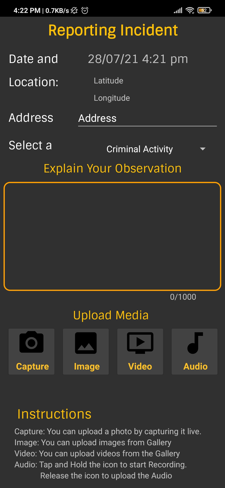
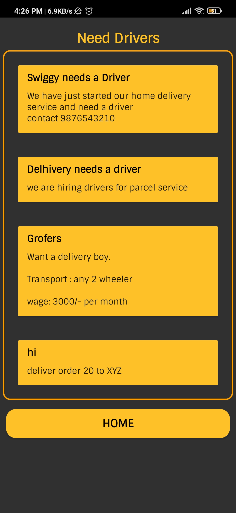

# Jan-Sahyog : Crime Reporting & SOS Services

## :point_right: Introduction
Jan Sahyog is an Android Application, developed for a niche of Driver Community, that facilitates the features of Crime Reporting, SOS Services, etc. It is built using Java for Android, under my one of the internships.

## Key Features:
The features of the Application is mentioned as follows, and you can find the screenshots below:

 - One-Touch SMS sending to all the Emergency Contacts.The SMS included Latitude & Longitude of the User, along with Help message.
 - Crime Reporting with automatic capturing Location and Address.
 - Reporting crime with Touch & Hold audio recording, facilitating crime reporting for illiterates.
 - App supports booking of vehicles, for all kind of vehicles. A driver can look for services needed by someone.
 - App was developed majorly for drivers, thus provides an option of Job Searching/Posting facility as well.
 - It has a Forum feature as well, where incidents can be reported.
---

## Screenshots

	
- Home Screen  

 
	
- SOS Service + Emergency Calls
	
	

	
- Crime / Incident Reporting

- Job Portal
	

  &nbsp; &nbsp; &nbsp; 

	
- Forum
	
	

👉 Download the APK from [here](https://github.com/IamLucif3r/Jan-Sahyog/releases/tag/v1.0)

## :point_right: Contribution
If you feel like adding any features, you are welcome. Fork this repository, apply the changes and send me the PR, I'll merge your changes.
